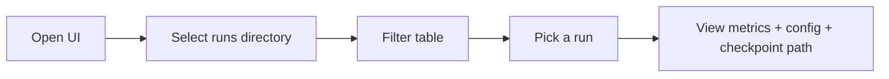
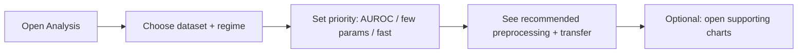
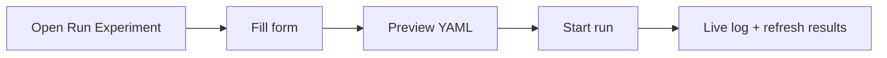
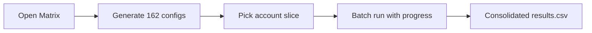

# UI — stack, scope, and user flows

Phase 0 decisions for the researcher-facing dashboard. The UI is **not** a clinical
diagnostic tool; it helps the team inspect experiment results and (later) run the
harness without editing YAML by hand.

## Stack decision

| Option | Verdict |
|--------|---------|
| **Streamlit** (chosen) | Python-only, reuses `src/` directly, fast to ship for internal researchers. |
| React + FastAPI | Better for public multi-user deploy; deferred unless we outgrow Streamlit. |
| Gradio | Good for single-model demos; too narrow for dashboards and batch orchestration. |

**MVP scope (v1):** read `runs/results.csv`, filter runs, view run detail, charts,
and a rule-based decision guide. Running experiments and the 162-run matrix come in
later phases.

**Charts:** Plotly in the UI layer; `matplotlib` stays for offline analysis scripts.

## Repository layout

```
src/ui/
  app.py              Streamlit home (entry point)
  config.py           UI paths and copy
  pages/              Multipage routes (Streamlit convention)
  components/         Reusable widgets (disclaimer, filters, …)
  services/           Data access over runs/ and configs/ (Phase 1)
scripts/run_ui.py     Launcher
.streamlit/config.toml
```

The UI package imports existing harness code (`src.training`, `src.utils`, …) and
never duplicates training logic.

## User flows

### Flow A — Inspect results (Phase 2, primary)



1. Researcher opens the dashboard.
2. UI loads `runs/results.csv` (or an empty state if missing).
3. Filter by dataset, preprocessing, transfer, regime, seed.
4. Click a run → detail page with metrics from `metrics.json`.

### Flow B — Decision guide (Phase 3)



Uses aggregated results (mean ± std over seeds). MVP uses simple ranking rules.

### Flow C — Run one experiment (Phase 4)



Form fields mirror `configs/example_run.yaml`. Backend calls `run_experiment()`.

### Flow D — Matrix batch (Phase 5, optional)



Depends on a batch runner in the training layer (ROADMAP item 2).

## How to run

From the repo root with the virtual environment active:

```bash
pip install -r requirements.txt
python scripts/run_ui.py
```

Or directly:

```bash
streamlit run src/ui/app.py
```

Default URL: http://localhost:8501

## Configuration

| Setting | Default (relative) | Override |
|---------|------------------|----------|
| Runs directory | `runs` | Sidebar path inputs on each page |
| Results CSV | `runs/results.csv` | Sidebar path inputs |
| Core matrix size | 162 | `src/ui/config.py` |

All UI paths are **repository-relative** strings. The services resolve them with `src.ui.paths.resolve_path` before filesystem access.

## Data services (Phase 1)

Import from `src.ui.services`:

| Function | Purpose |
|----------|---------|
| `load_results(path?)` | Parse `results.csv`; empty table if missing |
| `filter_results(table, **axes)` | Filter by dataset, preprocessing, transfer, regime, seed |
| `get_run_detail(run_name)` | Load `metrics.json` + artifact paths |
| `find_config_path` / `load_run_config` | Resolve YAML by run name |
| `aggregate_results(frame)` | Mean ± std over seeds per axis combo |
| `best_combinations(aggregated)` | Best combo per dataset × regime |
| `summarize_completion(frame)` | Progress toward 162 core runs |

Fixtures for tests live under `tests/fixtures/ui/`.

## Phase checklist

- [x] Phase 0 — stack, flows, scaffold, dependencies
- [x] Phase 1 — data services (`results.csv`, `metrics.json`, aggregation)
- [x] Phase 2 — results dashboard MVP
- [x] Phase 3 — charts and decision guide
- [x] Phase 4 — run experiment from UI
- [x] Phase 5 — matrix orchestration
